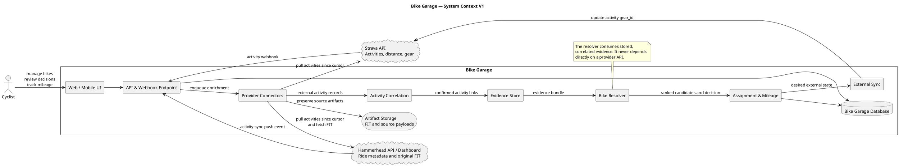
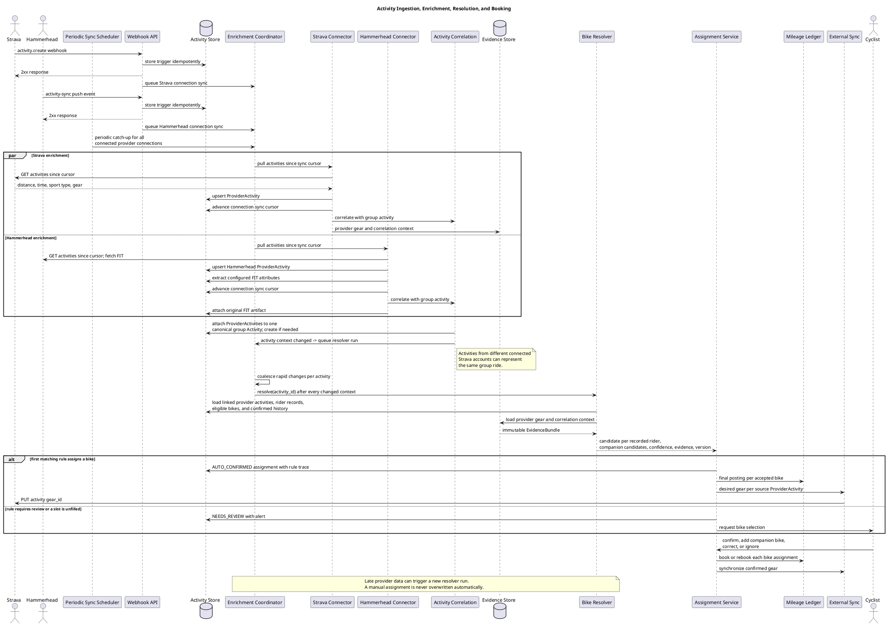

# Bike Garage — Architecture V1

## Architectural position

Strava and Hammerhead are both connected provider accounts. Each imported record is a `ProviderActivity`; matching records are correlated into one canonical group `Activity`. Strava records represent recorded riders in V1. Hammerhead records represent the recording device, retain the original FIT artifact, and expose configured FIT attributes such as bike type to resolver rules.

This separates three concerns:

1. **Connectors** communicate with external providers.
2. **Activity Correlation** decides which provider records describe the same physical ride.
3. **Bike Resolver** applies user-configured rules using provider records, normalized attributes, group context, and bike availability.

The resolver does not call Strava or Hammerhead directly. This keeps it deterministic, testable, and independent of provider availability.

Provider push events are sync hints, not authoritative activity payloads. A received Strava webhook or Hammerhead activity-sync event queues a cursor-based pull for precisely that `ProviderConnection`; duplicate events are coalesced. A periodic catch-up runs the same pull for every active connection to cover delayed or missed events.

## System context



## Provider responsibilities

| Source | Primary responsibility in V1 | Important limitation |
|---|---|---|
| Strava | Activity webhook triggers a cursor-based activity pull; records carry distance, sport type, current gear, and are the synchronization target | One group ride may produce several records; gear may be wrong |
| Hammerhead | Activity-sync push event triggers a cursor-based activity pull; records carry device ride metadata, original FIT file, and configured normalized attributes | Only the configured attribute catalogue is parsed in V1; hardware identities remain Phase 2 |
| User | Manual confirmation and correction | Highest assignment authority |

## Canonical group activity and provider records

```text
Activity
  id
  display_started_at
  display_ended_at
  display_distance_m
  activity_kind
  lifecycle_status

ProviderActivity
  id
  activity_id
  provider_connection_id
  external_id
  record_role
  started_at
  ended_at
  distance_m
  sport_type
  source_gear_id
  match_method
  match_confidence
  match_status
```

Example:

```text
Bike Garage Activity BG-4711
  ├─ Strava Jakez #123456 · 73.42 km
  ├─ Strava Conny #987654 · 73.18 km
  └─ Hammerhead Jakez #karoo-42 · 73.40 km · FIT attached
```

A direct shared identifier is preferred. Otherwise, correlation compares the two imported activities using start time, end time, distance, sport type, athlete, recording device, and optionally route similarity. The records are retained independently; only their presentation and shared resolver context are bundled.

Suggested states are `CONFIRMED_LINK`, `PROBABLE_LINK`, `AMBIGUOUS`, and `UNMATCHED`. Only sufficiently reliable links may produce strong bike evidence.

V1 correlation evaluates candidate records from different connected accounts with a conservative fingerprint:

- overlapping start/end windows, allowing a configurable clock and auto-pause offset;
- compatible sport type;
- comparable distance, within a configured percentage tolerance;
- optionally, route/track similarity when both tracks are available.

Records are bundled automatically only with a clear winning candidate and sufficient margin over alternatives. Otherwise they remain separate or enter a merge-review queue. Same day alone is never enough to merge rides.

The resolver receives the full bundled group. Every `ProviderActivity` with `record_role = RIDER_RECORD` identifies a recorded user and creates an expected `RECORDED_RIDER` assignment. Thus Jakez’s and Conny’s Strava recordings cause two bike assignments to be resolved. The linked Hammerhead `DEVICE_RECORD` retains the original FIT artifact but does not create another rider assignment or affect resolution in V1; an untracked companion remains an optional `COMPANION` assignment.

The canonical `Activity` does not own a `strava_gear_id`. `ProviderActivity.source_gear_id` belongs to one specific Strava account and source activity. A canonical activity can have several recorded riders and several bike assignments.

`Bike` also does not own a global Strava gear ID. A `BikeProviderLink` maps a physical bike to an `external_gear_id` within exactly one `ProviderConnection`. The uniqueness boundary is therefore `(provider_connection_id, external_gear_id)`, not the gear ID alone. A bike can be created manually with no links, or created during a Strava import together with its first imported link. Additional provider-account links may be added later.

```text
Activity BG-4711
  ├─ RECORDED_RIDER · Jakez · Tarmac · 73,420 m · Strava Jakez #123456
  ├─ RECORDED_RIDER · Conny · Crux   · 73,180 m · Strava Conny #987654
  └─ DEVICE_RECORD  · Hammerhead Jakez #karoo-42 · FIT attached

Strava Jakez #123456
  └─ gear_id = Tarmac Strava gear ID

Strava Conny #987654
  └─ gear_id = Crux Strava gear ID
```

```text
Tarmac
  ├─ BikeProviderLink · Strava Jakez · gear_id = #gear-42
  └─ BikeProviderLink · Strava Dennis · gear_id = #bike-915
```

Each accepted assignment produces its own mileage entry. A recorded rider's distance comes from that rider's provider activity; companion distance defaults to the group activity distance but can be overridden when the companion joined only part of the ride.

## Source artifacts

Raw source data is preserved separately from the canonical domain model:

```text
ActivityArtifact
  id
  activity_id
  provider
  artifact_type = FIT_FILE | JSON_RESPONSE | WEBHOOK
  checksum
  fetched_at
  storage_reference
  parser_version
```

This retains source provenance and makes later parsing possible without calling external systems again. V1 extracts only configured normalized attributes, such as Hammerhead bike type, for resolver rules; hardware identity parsing remains Phase 2.

## Activity ingestion, enrichment, and resolution



## Enrichment lifecycle

Provider data may arrive at different times. Each activity therefore tracks source progress:

```text
ActivityEnrichment
  activity_id
  source = STRAVA | HAMMERHEAD
  status = PENDING | COMPLETE | FAILED | NOT_AVAILABLE
  last_attempt_at
  completed_at
  error_code
```

Resolution begins when all expected sources are terminal or a configured deadline expires. Late evidence can cause a new resolver run, but:

- manually confirmed assignments are never changed automatically;
- a conflicting late result should enter review instead of silently rebooking;
- a new run stores its own resolver version and evidence snapshot.

## Core domain model

```plantuml
@startuml
title Bike Garage — Core Domain Model V1

hide methods
skinparam linetype ortho

entity User {
  * id : UUID <<PK>>
  --
  display_name : string
  email : string?
  login_enabled : boolean
  timezone : string?
  created_at : instant
}

entity ProviderConnection {
  * id : UUID <<PK>>
  --
  user_id : UUID <<FK>>
  provider : enum
  external_account_id : string
  status : enum
  capabilities : json
  activity_sync_cursor : string?
  last_activity_sync_at : instant?
  last_synced_at : instant?
}

entity Bike {
  * id : UUID <<PK>>
  --
  user_id : UUID <<FK>>
  name : string
  bike_type : enum
  photo_storage_reference : string
  status : enum
  created_via : MANUAL | PROVIDER_IMPORT
  created_at : instant
}

entity BikeProviderLink {
  * id : UUID <<PK>>
  --
  bike_id : UUID <<FK>>
  provider_connection_id : UUID <<FK>>
  external_gear_id : string
  external_name : string?
  link_source : IMPORTED | MANUAL
  linked_at : instant
  unlinked_at : instant?
}

entity BikeMileageTracking {
  * bike_id : UUID <<PK, FK>>
  --
  tracking_started_at : instant
  historical_import_mode : enum
  created_at : instant
}

entity BikeAvailability {
  * id : UUID <<PK>>
  --
  bike_id : UUID <<FK>>
  starts_at : instant
  ends_at : instant?
  status : AVAILABLE | UNAVAILABLE
  reason : string?
  created_at : instant
}

entity Activity {
  * id : UUID <<PK>>
  --
  display_started_at : instant
  display_ended_at : instant?
  display_distance_m : bigint?
  expected_bike_count : integer
  activity_kind : enum
  lifecycle_status : enum
  created_at : instant
}

entity ProviderActivity {
  * id : UUID <<PK>>
  --
  activity_id : UUID? <<FK>>
  provider_connection_id : UUID <<FK>>
  external_id : string
  record_role : RIDER_RECORD | DEVICE_RECORD
  started_at : instant
  ended_at : instant?
  distance_m : bigint
  sport_type : string
  source_gear_id : string?
  normalized_attributes : json
  match_method : enum
  match_confidence : decimal
  match_status : enum
  matched_at : instant
}

entity ActivityArtifact {
  * id : UUID <<PK>>
  --
  activity_id : UUID <<FK>>
  provider_activity_id : UUID? <<FK>>
  provider : enum
  artifact_type : enum
  checksum : string
  storage_reference : string
  fetched_at : instant
  parser_version : integer?
}

entity ActivityEnrichment {
  * id : UUID <<PK>>
  --
  activity_id : UUID <<FK>>
  source : enum
  status : enum
  attempt_count : integer
  last_attempt_at : instant?
  completed_at : instant?
  error_code : string?
}

entity EvidenceSnapshot {
  * id : UUID <<PK>>
  --
  activity_id : UUID <<FK>>
  resolver_version : integer
  thresholds : json
  enrichment_status : json
  generated_at : instant
}

entity ResolverRule {
  * id : UUID <<PK>>
  --
  user_id : UUID <<FK>>
  name : string
  priority : integer
  enabled : boolean
  rule_kind : SLOT_REQUIREMENT | BIKE_ASSIGNMENT
  applies_to : enum
  conditions : json
  actions : json
  stop_processing : boolean
  created_at : instant
  updated_at : instant
}

entity ResolverRuleRun {
  * id : UUID <<PK>>
  --
  activity_id : UUID <<FK>>
  resolver_rule_id : UUID <<FK>>
  trigger : enum
  outcome : enum
  input_snapshot : json
  evaluated_at : instant
}

entity ActivityBikeAssignment {
  * id : UUID <<PK>>
  --
  activity_id : UUID <<FK>>
  bike_id : UUID? <<FK>>
  rider_user_id : UUID? <<FK>>
  source_provider_activity_id : UUID? <<FK>>
  role : RECORDED_RIDER | COMPANION
  distance_m : bigint
  coverage : enum
  confidence : decimal
  status : enum
  resolver_version : integer
  resolver_rule_id : UUID? <<FK>>
  evidence_snapshot_id : UUID
  decided_at : instant
}

entity AssignmentEvidence {
  * id : UUID <<PK>>
  --
  assignment_id : UUID <<FK>>
  candidate_bike_id : UUID <<FK>>
  evidence_type : enum
  source_provider : enum?
  source_reference : string?
  score : integer
  raw_value : json
  explanation : string
}

entity MileageEntry {
  * id : UUID <<PK>>
  --
  bike_id : UUID <<FK>>
  assignment_id : UUID? <<FK>>
  activity_id : UUID? <<FK>>
  entry_type : enum
  distance_m : bigint
  effective_at : instant
  booking_status : enum
  reverses_entry_id : UUID? <<FK>>
  source : enum
  created_at : instant
}

entity ExternalSyncAttempt {
  * id : UUID <<PK>>
  --
  provider_activity_id : UUID <<FK>>
  assignment_id : UUID? <<FK>>
  provider : enum
  operation : enum
  desired_value : json
  result : enum
  attempt_count : integer
  last_attempt_at : instant?
}

entity AuditEvent {
  * id : UUID <<PK>>
  --
  user_id : UUID <<FK>>
  actor_type : enum
  actor_id : string?
  action : string
  entity_type : string
  entity_id : UUID
  before_value : json?
  after_value : json?
  occurred_at : instant
}

User ||--o{ ProviderConnection
User ||--o{ Bike
Bike ||--|| BikeMileageTracking
Bike ||--o{ BikeAvailability
Bike ||--o{ BikeProviderLink
ProviderConnection ||--o{ BikeProviderLink
ProviderConnection ||--o{ ProviderActivity
Activity |o--o{ ProviderActivity : group membership
ProviderActivity ||--o{ ActivityArtifact
Activity ||--o{ ActivityArtifact
Activity ||--o{ ActivityEnrichment
Activity ||--o{ EvidenceSnapshot
User ||--o{ ResolverRule
Activity ||--o{ ResolverRuleRun
ResolverRule ||--o{ ResolverRuleRun
Activity ||--o{ ActivityBikeAssignment
Bike |o--o{ ActivityBikeAssignment
User |o--o{ ActivityBikeAssignment : optional rider
ProviderActivity |o--o{ ActivityBikeAssignment : source record
EvidenceSnapshot |o--o{ ActivityBikeAssignment
ResolverRule |o--o{ ActivityBikeAssignment
ActivityBikeAssignment ||--o{ AssignmentEvidence
ActivityBikeAssignment |o--o{ MileageEntry
Activity |o--o{ MileageEntry
Bike ||--o{ MileageEntry
ProviderActivity ||--o{ ExternalSyncAttempt
ActivityBikeAssignment |o--o{ ExternalSyncAttempt
User ||--o{ AuditEvent

note top of User
  A person known to Bike Garage.
  May only be stored for ownership
  and ride participation, or may
  also be allowed to sign in.
end note

note top of ProviderConnection
  One authorized account at an
  external provider, for example
  Conny's Strava. It owns its
  sync cursor, health, and tokens.
end note

note top of Activity
  One canonical physical group ride,
  shown once in the activity stream.
  It groups source records and tracks
  the number of bikes expected for
  a complete assignment.
end note

note top of ProviderActivity
  One source record from one provider
  connection. Strava creates rider
  slots; Hammerhead adds device context
  and configured FIT attributes.
end note

note left of ActivityArtifact
  Immutable original input: webhook,
  provider response, or FIT file.
  It is stored with checksum and origin
  so parsing can be repeated and every
  derived fact can be traced back.
end note

note right of ActivityEnrichment
  Tracks the import lifecycle for every
  expected source of an Activity:
  pending, complete, failed, or absent.
  It supports retries and explains why
  provider context may still be missing.
end note

note left of EvidenceSnapshot
  Immutable snapshot of the exact
  provider records, attributes, rules,
  availability, and thresholds read by
  one resolver run. It makes a later
  decision reproducible and auditable.
end note

note right of ResolverRule
  One of two declarative rule kinds:
  Bike Slot Rules run first to create
  expected slots; Bike Assignment Rules
  then fill each free slot. Lower priority
  runs earlier within its own kind. Rules
  contain safe conditions and actions,
  never executable user code.
end note

note left of ResolverRuleRun
  Audit trail for a single evaluation:
  trigger, rule, outcome, timestamp,
  and the input snapshot used.
end note

note right of ActivityBikeAssignment
  One expected, automatic, or manual
  bike use for a recorded rider or
  companion. It preserves the winning
  rule, evidence, status, and distance.
end note

note right of MileageEntry
  Immutable ledger posting for opening
  balance, activity distance, correction,
  or reversal. Bike totals are projections
  over active entries, never counters.
end note

@enduml
```



### Entity guide

| Entity | Purpose |
|---|---|
| `User` | A person in the system. `login_enabled` distinguishes a stored person from someone who can sign in. |
| `ProviderConnection` | One authorized external account for a User, including its independent sync cursor. |
| `Bike` | One physical bicycle, created manually or from an imported provider gear record. It has one required primary photo for recognition in the UI. |
| `BikeProviderLink` | The optional mapping of one Bike to one gear record inside one specific provider connection. It is never global. |
| `BikeMileageTracking` | The bike-specific tracking cutoff and historical-import policy. |
| `BikeAvailability` | A dated availability interval used to exclude bikes that could not have been ridden. |
| `Activity` | The canonical group ride displayed once in the activity stream. It bundles matching source records. |
| `ProviderActivity` | One activity record imported from one provider account. In V1, Strava is a `RIDER_RECORD`; Hammerhead is a `DEVICE_RECORD` with a FIT artifact and configured normalized attributes. |
| `ActivityArtifact` | An immutable original payload or FIT file retained for reparsing and auditability. |
| `ActivityEnrichment` | Progress and retry state for Strava and Hammerhead imports. |
| `EvidenceSnapshot` | The complete, versioned input context used by one resolver run. |
| `ResolverRule` | One enabled or disabled declarative Bike Slot Rule or Bike Assignment Rule. Each kind has its own ascending priority order. |
| `ResolverRuleRun` | An auditable evaluation of one rule for an activity context and trigger. |
| `ActivityBikeAssignment` | An expected or confirmed bike participation for a recorded rider or untracked companion. |
| `AssignmentEvidence` | One durable explanation item for an assignment, such as a matched rule condition or an action result. |
| `MileageEntry` | An immutable opening balance, activity booking, correction, or reversal used to calculate mileage. |
| `ExternalSyncAttempt` | An auditable attempt to write a resolved gear choice back to the relevant Strava activity. |
| `AuditEvent` | A history record of a user or system change, including before/after state. |

### Why `rider_user_id` is optional

`ActivityBikeAssignment` maps an activity to a bike. The optional `rider_user_id` adds who rode that bike when this is known:

```text
Activity BG-4711
  RECORDED_RIDER · rider_user = Jakez · bike = Tarmac
  RECORDED_RIDER · rider_user = Conny · bike = Crux
  COMPANION      · rider_user = Lea   · bike = Gravel
```

A `User` can simply be a stored person, such as Lea, or a person who can log in. `login_enabled = false` means the User is only used for ownership and ride participation; it has no authentication or provider connection. It remains nullable because mileage can still be assigned to a companion bike when the rider is unknown or irrelevant.

If named riders and rider statistics are removed from the product scope, `rider_user_id` can be removed without affecting multi-bike assignments, mileage, or Strava synchronization.

### Tracking cutoff and opening balance

`BikeMileageTracking.tracking_started_at` defines when automatic activity assignment and mileage tracking begin for a bike. Earlier mileage is represented by a ledger entry rather than a mutable bike counter:

```text
MileageEntry
  entry_type = OPENING_BALANCE
  activity_id = null
  assignment_id = null
  effective_at = tracking_started_at
  distance_m = user-provided opening mileage
```

Subsequent activity assignments create `ACTIVITY` entries. Corrections create `MANUAL_ADJUSTMENT` or `REVERSAL` entries.

## Consistency rules

- One canonical `Activity` per bundled group ride in the activity stream.
- One `ProviderActivity` per provider connection and external activity ID.
- A provider activity belongs to zero or one canonical group activity; uncorrelated records remain available for later matching.
- A group activity contains one or more provider activities and may contain several recorded riders.
- Each linked `RIDER_RECORD` provider activity creates at most one current `RECORDED_RIDER` assignment for the User who owns that connection. A `DEVICE_RECORD` retains an artifact only in V1.
- Companion assignments are independent of provider activities.
- At most one active mileage posting per activity-bike assignment.
- A bookable assignment and its active mileage entry point to the same bike.
- A recorded-rider assignment may synchronize only the `gear_id` on its own source provider activity and only when the selected Bike has an active `BikeProviderLink` for that same Strava connection; companion assignments never synchronize Strava.
- `BikeProviderLink.external_gear_id` is unique within its `provider_connection_id` while the link is active.
- `rider_user_id` is optional; when present, it identifies the person who rode the assigned bike.
- An activity before `BikeMileageTracking.tracking_started_at` is not automatically booked unless historical import explicitly includes it.
- `OPENING_BALANCE` and `MANUAL_ADJUSTMENT` mileage entries have no activity assignment.
- Assignment, ledger change, and audit record commit atomically.
- Provider writes happen asynchronously after the internal transaction commits.
- Raw artifacts and resolver evidence retain provenance.

## Decisions still to validate

1. Which Hammerhead endpoints and authentication mechanisms are officially available for automatic ride and FIT retrieval?
2. Can provider records be linked by explicit IDs, or is fingerprint matching required?
3. How long should the resolver wait for enrichment before making its first decision?
4. Should provisional mileage appear in primary totals or only as a separate value?
