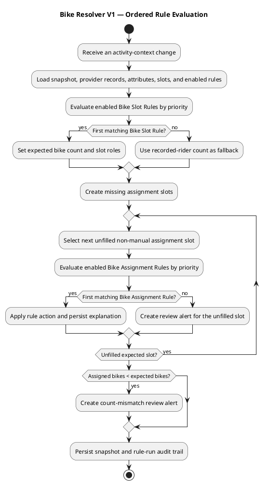

# Bike Garage — Bike Resolver V1

## Responsibility

The Bike Resolver is a user-configurable, ordered two-stage rule engine. It resolves a canonical group `Activity` whenever its provider data changes: first **Bike Slot Rules** determine how many bike slots the activity requires; then **Bike Assignment Rules** select a bike for every free slot.

The resolver does not call provider APIs, correlate activities, post mileage, or update Strava. Connectors import provider records and extract configured attributes; correlation maintains the canonical group; the assignment service books mileage and performs external synchronization.

## Resolver triggers

The resolver is queued idempotently whenever any of these events changes an Activity's decision context:

1. a `ProviderActivity` is imported or updated;
2. a ProviderActivity is linked to or unlinked from the canonical Activity;
3. configured Hammerhead FIT attributes have been extracted, for example a bike type;
4. a Resolver Rule is enabled, disabled, reordered, or edited;
5. a user changes an assignment or resolves a review item.

Runs are coalesced per `activity_id`. A later Hammerhead record linked to an already resolved group therefore creates a new run with the expanded context. Manual assignments are immutable to automatic rules.

## Bike Slot Rules: required bike count and slots

`Activity.expected_bike_count` is the number of bike assignments Bike Garage expects before the activity is complete. Bike Slot Rules are evaluated first, in priority order. The first matching Bike Slot Rule declares the expected count and creates the corresponding recorded-rider or companion slots. The standard fallback is the number of linked `RIDER_RECORD` provider activities—one Strava record means one expected bike, two independently recorded Strava activities mean two.

A Bike Slot Rule can deliberately require an additional companion slot. `DEVICE_RECORD`s such as Hammerhead enrich the decision context but do not raise the count by themselves.

```text
Group Activity BG-4711
  Strava · Jakez  -> expected recorded-rider slot 1
  Strava · Conny  -> expected recorded-rider slot 2
  Hammerhead · Jakez -> context only

expected_bike_count = 2
assigned_bike_count = 2  -> complete
```

If `assigned_bike_count < expected_bike_count`, the activity carries a visible manual-review alert until a rule or user fills the missing slot.

## Rule model

```text
ResolverRule
  id
  user_id
  name
  priority                 // lower number runs first
  enabled
  rule_kind = SLOT_REQUIREMENT | BIKE_ASSIGNMENT
  applies_to = ACTIVITY | RECORDED_RIDER | COMPANION
  conditions[]             // ANDed predicates
  actions[]                // applied when all conditions match
  stop_processing = true
  created_at
  updated_at

ResolverRuleRun
  id
  activity_id
  resolver_rule_id
  trigger = PROVIDER_ACTIVITY_CHANGED | GROUP_LINKED | ATTRIBUTE_EXTRACTED | RULE_CHANGED | MANUAL_CHANGE
  outcome = MATCHED | NOT_MATCHED | SKIPPED | BLOCKED_BY_MANUAL
  evaluated_at
  input_snapshot
```

Each rule kind has its own ordered priority list: rules are ordered by `priority ASC`, then `updated_at ASC` as a stable tie-breaker. Conditions are declarative—not executable user code—and are all required. Bike Slot Rules run before Bike Assignment Rules. For each free, non-manual slot, the first matching Bike Assignment Rule wins. `stop_processing = true` is the default and implements first-match-wins.

### Condition catalogue V1

| Condition | Example |
|---|---|
| Provider record present | `Strava · Conny is linked to the group` |
| Provider connection matches | `provider_connection_id = Conny Strava` |
| Provider account matches | `external_account_id = Jakez` |
| Provider record role | `RIDER_RECORD` or `DEVICE_RECORD` |
| Provider activity type | `sport_type = GravelRide` |
| Extracted provider attribute | `Hammerhead FIT bike_type = ROAD` |
| Group expected-bike count | `expected_bike_count >= 2` |
| Assignment slot/rider | `recorded rider = Jakez` |
| Bike availability | `Tarmac is available` |

Hammerhead FIT parsing in V1 is deliberately limited to configured, provider-normalized attributes such as bike type. Raw device identities and BLE evidence remain Phase 2.

### Actions by rule kind

| Action | Result |
|---|---|
| `SET_REQUIRED_BIKE_COUNT` | **Bike Slot Rule:** declare the expected number of bike slots and their rider/companion roles. |
| `ASSIGN_BIKE` | **Bike Assignment Rule:** select a specified Bike for the targeted free slot. |
| `REQUIRE_MANUAL_REVIEW` | **Bike Assignment Rule:** add a visible exclamation-mark alert; no bike is assigned automatically. |
| `SET_ASSIGNMENT_DISTANCE` | Set full-activity or explicit distance for the action's assignment. |

An automatic `ASSIGN_BIKE` creates an `AUTO_CONFIRMED` assignment only if the target bike is available and the action is not contradicted by an existing manual assignment. An action that cannot be applied emits a review alert instead of overwriting data.

## Resolution flow



## Example rules

### Bike Slot Rule 10 — Two recorded riders

```text
WHEN
  Strava · Conny RIDER_RECORD is linked
THEN
  SET_REQUIRED_BIKE_COUNT = 2
  create recorded-rider slots for Jakez and Conny
  stop_processing = true
```

### Bike Assignment Rule 10 — Jakez' road bike from Hammerhead

```text
WHEN
  Hammerhead · Jakez DEVICE_RECORD is linked
  AND Hammerhead FIT bike_type = ROAD
  AND target recorded rider = Jakez
THEN
  ASSIGN_BIKE Tarmac to Jakez' recorded-rider slot
  stop_processing = true
```

### Bike Assignment Rule 20 — Conny's bike in the group ride

```text
WHEN
  Strava · Conny RIDER_RECORD is linked
  AND expected_bike_count >= 2
THEN
  ASSIGN_BIKE Crux to Conny's recorded-rider slot
  stop_processing = true
```

### Bike Assignment Rule 90 — Escalate incomplete rides

```text
WHEN
  assigned_bike_count < expected_bike_count
THEN
  REQUIRE_MANUAL_REVIEW
    reason = "A bike is still missing for this group ride"
```

## Explainability and sync

Every resulting assignment displays the winning rule, its priority, all matched conditions, selected action, and the trigger that caused the run. A `REQUIRE_MANUAL_REVIEW` action is shown as an exclamation mark on the activity stream and detail page.

Only an auto-confirmed or manually confirmed recorded-rider assignment may synchronize Strava, and only when the selected bike has a `BikeProviderLink` for that same Strava connection. Companion assignments never synchronize Strava.

## Safety rules

- Automatic rules never overwrite a manually confirmed assignment.
- Rule edits affect future runs; past runs retain their input snapshot and rule version.
- A missing mapped bike, unavailable bike, or ambiguous target produces a review alert rather than a guessed assignment.
- Rule priority is explicit and visible; drag-and-drop order is persisted as priority values.
- Re-running a rule engine is idempotent for the same activity snapshot and rule set.

## Deferred to Phase 2

Hardware identities, BLE/Scanner evidence, and free-form user scripts remain outside the resolver. Rules use the fixed condition and action catalogue above.
