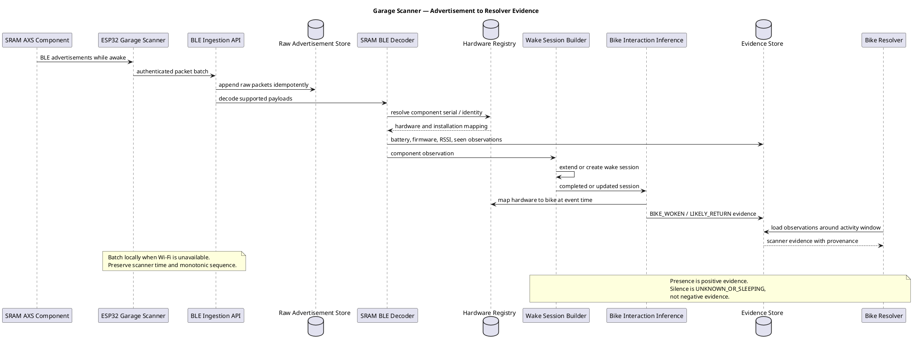
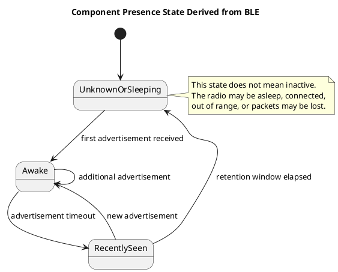

# Bike Garage — Garage Scanner and BLE Observations (Phase 2)

> **Phase 2 design only.** No scanner, Bluetooth ingestion, raw packet storage, battery state, or scanner-derived resolver evidence is part of V1.

## Purpose

An ESP32 in the garage passively listens for BLE advertisements from bike components. Bike Garage stores the received packets, extracts stable hardware and battery observations, groups advertisement bursts into wake sessions, and derives cautious bike-interaction evidence for the resolver.

The scanner is not a mileage source. Its key product value is:

- identifying which component was recently awake;
- inferring which bike was moved or touched;
- detecting likely departure and return windows;
- retaining battery voltage, percentage where available, signal strength, and last-seen state;
- providing additional evidence for primary and companion-bike resolution.

## What an ESP32 can receive

A generic BLE scan result can contain:

| Field | Meaning |
|---|---|
| Scanner timestamp | When this scanner received the packet |
| BLE address and address type | Radio address; it must not be assumed to be a permanent identity |
| Local name | Human-readable advertised name when included |
| Service UUIDs | Advertised Bluetooth services |
| Service data | Raw provider-specific bytes associated with a service UUID |
| Manufacturer ID and data | Raw manufacturer-specific payload |
| RSSI | Received signal strength at this scanner |
| TX power | Optional advertised transmit power |
| Connectable flag | Whether the advertisement indicates a connectable peripheral |

Not every packet contains every field. Scan responses and advertisements may also expose different portions of the data.

## Observed SRAM AXS advertisements

SRAM does not currently provide a public specification for the AXS BLE advertisement payload used here. The following is based on independently reproduced protocol analysis and must therefore remain behind a versioned parser.

Observed awake AXS components advertise with:

- Local name `SRAM <decimal component serial>`.
- SRAM Bluetooth service UUID `0xFE51`.
- Manufacturer data under company ID `0x0933`.
- Live battery voltage in millivolts in the observed manufacturer payload.
- Firmware-related bytes.
- A component serial in service data.
- Battery percentage for rechargeable AXS-pack components in the observed payloads.
- No usable percentage for observed coin-cell components; voltage is the better stored measurement.
- A payload value that can help discriminate certain component classes, but should remain provisional until validated across more devices.

Observed radio behavior:

- Physical movement or an AXS-button press can wake components.
- Rechargeable-pack components were observed advertising for roughly five minutes after wake.
- Coin-cell controllers were observed advertising for only roughly 20–24 seconds.
- Components eventually become silent to conserve power.
- Connecting the official app can suppress some or all passive advertisements.
- Packet absence can also result from radio loss, range, interference, or scanner downtime.

Therefore, a received advertisement is positive evidence that a component is awake. Silence is not proof that the component or bike is inactive.

Sources and implementation references:

- [SRAM: AXS components broadcast battery and shift data](https://www.sram.com/en/sram/road/campaigns/pairing-your-bike-computer-with-SRAM-etap-axs-components)
- [SRAM: AXS sleep and wake behavior](https://www.sram.com/en/learn/axs-digital-troubleshooting)
- [Reverse-engineered SRAM AXS BLE advertisement format](https://github.com/tarekrached/esphome-sram-axs/blob/main/docs/protocol.md)

## Persistence model

### Scanner

```text
Scanner
  id
  user_id
  name
  location
  credential_id
  firmware_version
  clock_offset_ms
  last_seen_at
  status
```

### Raw advertisement

```text
BleAdvertisement
  id
  scanner_id
  received_at
  scanner_sequence
  ble_address_hash
  address_type
  local_name
  service_uuids
  service_data_raw
  manufacturer_id
  manufacturer_data_raw
  rssi
  tx_power
  is_connectable
  payload_hash
  decoder_status
  ingested_at
```

The raw bytes must be retained so that a corrected decoder can reprocess historical packets. Because an awake component can advertise several times per second, raw retention should be configurable. A practical design is:

- append every received packet or lossless scanner batch to time-partitioned storage;
- retain detailed packets for a defined diagnostic period;
- retain normalized observations, wake sessions, and interaction events long term;
- optionally archive compressed raw batches to object storage for later reprocessing.

### Normalized device observation

```text
DeviceObservation
  id
  hardware_identity_id
  advertisement_id
  observation_type
  numeric_value
  text_value
  unit
  observed_at
  parser_version
  decode_confidence
```

Typical observation types:

- `COMPONENT_SERIAL`
- `BATTERY_VOLTAGE_MV`
- `BATTERY_PERCENT`
- `BATTERY_BAND`
- `FIRMWARE_VERSION`
- `COMPONENT_CLASS`
- `RSSI`
- `ADVERTISEMENT_SEEN`

Unknown bytes are preserved only in the raw packet until their meaning is understood.

### Device wake session

Repeated packets from one component are grouped into a wake session:

```text
DeviceWakeSession
  id
  hardware_identity_id
  scanner_id
  first_seen_at
  last_seen_at
  packet_count
  peak_rssi
  latest_battery_voltage_mv
  latest_battery_percent
  end_reason = SILENCE_TIMEOUT | SCANNER_OFFLINE | OPEN
```

This is the durable representation of “the component was active around this time.” It avoids treating thousands of repeated advertisements as thousands of independent resolver signals.

### Bike interaction event

One or more wake sessions are mapped through hardware identities and component installation intervals to a bike:

```text
BikeInteractionEvent
  id
  bike_id
  event_type
  started_at
  ended_at
  confidence
  inference_version
  evidence_session_ids[]
```

Suggested event types:

- `BIKE_WOKEN`
- `BIKE_RECENTLY_SEEN`
- `LIKELY_DEPARTURE`
- `LIKELY_RETURN`
- `MULTIPLE_COMPONENTS_ACTIVE`

`LIKELY_DEPARTURE` and `LIKELY_RETURN` are contextual inferences. They are not raw BLE facts.

## Scanner processing flow



## Derived component state



## Resolver use

Scanner evidence is evaluated relative to activity boundaries:

- A unique bike component waking shortly before activity start supports a departure hypothesis.
- The same component appearing shortly after activity end supports a return hypothesis.
- Several components installed on the same bike waking together are stronger than one packet.
- Two bikes with coherent departure and return sessions may suggest a companion-bike assignment.
- A single missing wake or return session must not penalize a bike.
- Scanner evidence decays with time distance from the activity boundary.

For companion bikes, scanner evidence may create a suggestion but should normally require confirmation in V1. It cannot prove that the companion completed the full activity distance.

## Reliability and operational requirements

- Authenticate each scanner with revocable credentials.
- Buffer packets locally during network outages and upload them with original timestamps.
- Include a monotonic scanner sequence to detect duplicates and gaps.
- Monitor clock drift and scanner offline periods.
- Partition high-volume raw data by scanner and time.
- Keep decoder and inference versions with all derived records.
- Never key a physical component only by BLE address.
- Deduplicate resolver evidence by physical hardware identity and evidence family.
- Treat battery percentage as nullable; retain voltage and raw payload when available.
- Surface unknown device serials so the user can assign them to a component or bike.

## Questions to validate on the real bike

1. Which installed SRAM component types advertise in the garage?
2. Which fields and packet variants appear for the exact firmware versions in use?
3. Does movement wake only the derailleur, or also other installed components?
4. How long does each component type advertise after movement and button presses?
5. How reliably can one scanner distinguish bikes by RSSI at their parking positions?
6. How often does an AXS app or other connection suppress advertisements?
7. What raw-packet retention period is useful without creating unnecessary storage volume?
