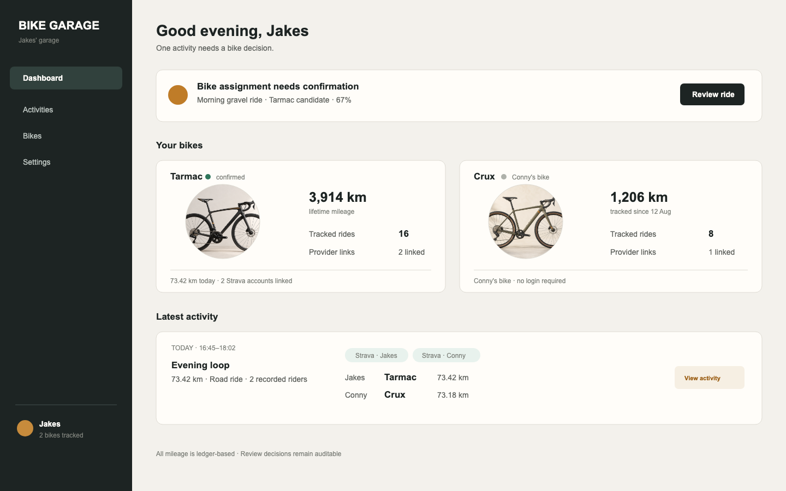
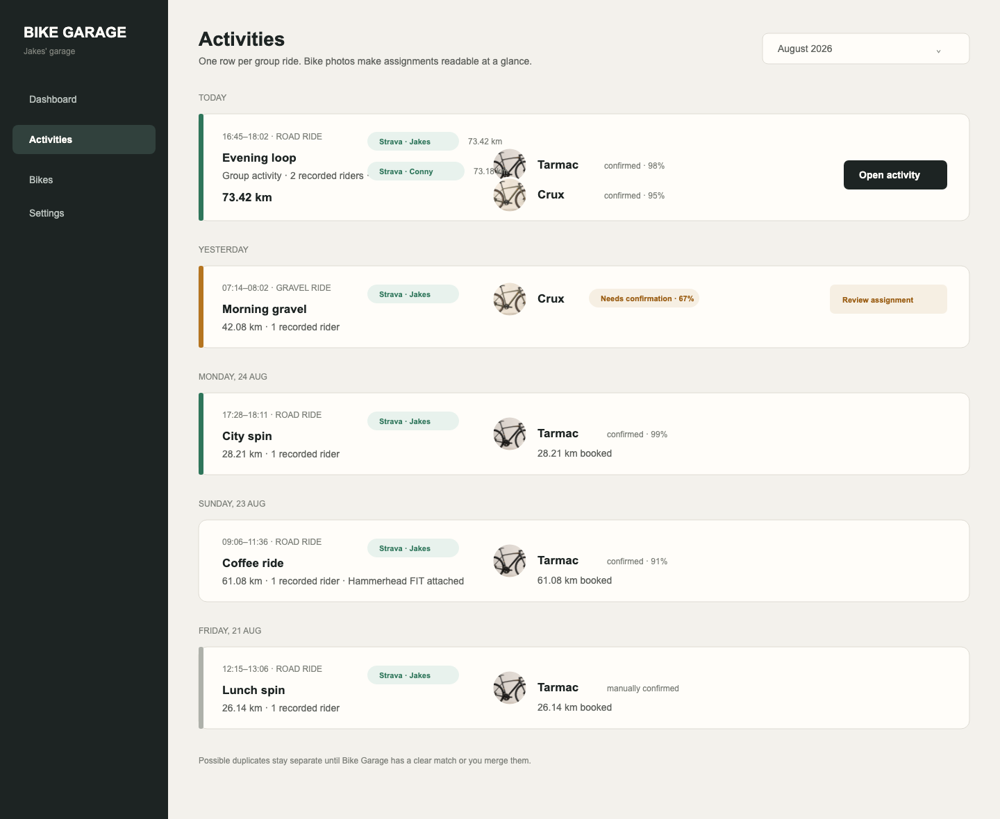
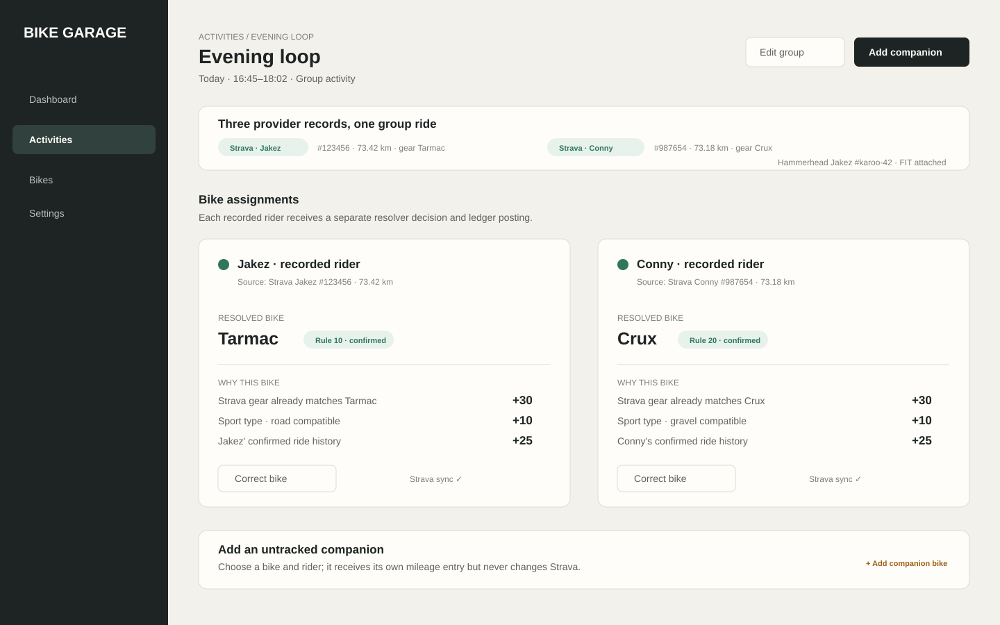
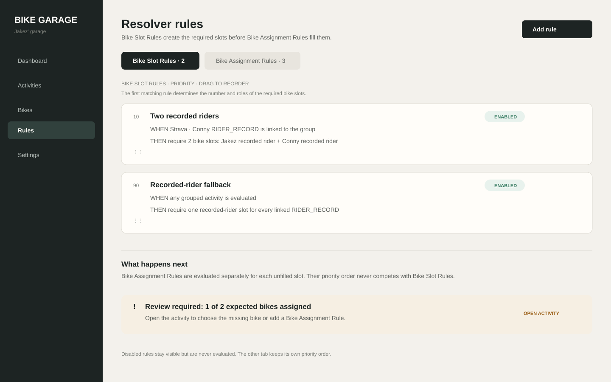
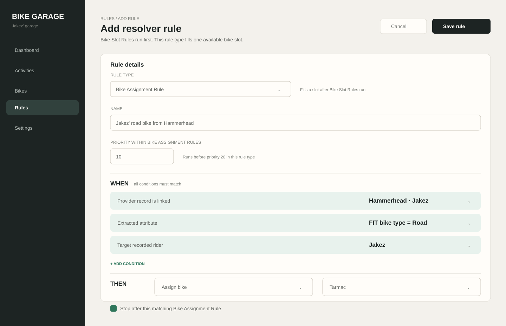
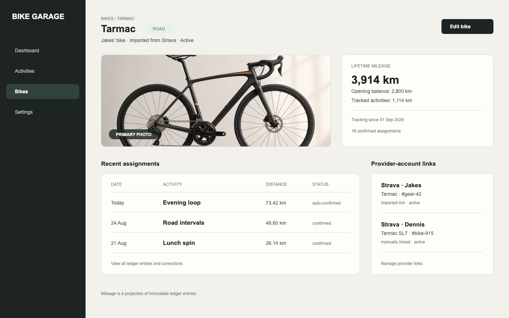

# Bike Garage — User Interface V1

## UI goal

The interface makes multi-source ride data understandable: one group ride, the bikes assigned to it, the evidence for each decision, and the mileage that results. It should feel like a calm bike logbook, not an integration console.

## Navigation

Desktop uses a persistent left navigation; mobile uses the same five destinations in a bottom bar.

| Destination | Purpose |
|---|---|
| Dashboard | Review queue, recent grouped rides, and bike mileage overview. |
| Activities | Canonical group-ride stream and activity review. |
| Bikes | Bike cards, mileage ledger, assignment history, and provider-account gear links. |
| Rules | Ordered Bike Slot Rules and Bike Assignment Rules, plus rule-run history. |
| Settings | Users, provider connections, resolver thresholds, and data import. |

## Visual language

- Dark graphite app shell, off-white work surface, and one warm amber attention accent.
- Bike type is communicated through a small color marker, never color alone.
- Confidence uses words first: **Confirmed**, **Needs confirmation**, or **Review needed**. A percentage is supporting detail.
- Provider sources appear as readable labels such as `Strava · Jakez`; raw IDs appear only in detail views.
- Mileage totals identify whether they include provisional entries.
- Every bike has a required primary photo. It is shown prominently on the bike page and as a circular thumbnail beside bike names in the activity stream.

## 1. Dashboard

The dashboard starts with decisions that need attention, then gives a compact view of recent group rides and bike mileage.



Primary actions:

- Open an assignment needing review.
- Open a grouped activity.
- Open a bike detail.
- Resolve a provider connection problem.

## 2. Activity stream

One canonical group ride appears once. The row exposes enough context to explain why it is grouped and which bikes still need a decision.



Each row shows:

- canonical start time and representative distance;
- linked provider records and their small distance differences;
- recorded riders and assigned bikes, each with the bike photo thumbnail;
- review state; and
- an expandable source trail for diagnostics.

Group merge behavior:

- A confident match is shown as one grouped row.
- An ambiguous match remains separate and gets a quiet “possible duplicate” review marker.
- The user can merge or split a group manually; this changes grouping, not the original provider records.

## 3. Activity detail and resolver review

The detail page answers “which bikes were ridden, and why?” For every recorded rider, the resolver creates a separate assignment card. Untracked participants can be added manually.



Assignment card behavior:

- **Confirmed** assignments can be corrected without losing their evidence history.
- **Needs confirmation** assignments show the best candidate but do not change Strava.
- **Review needed** assignments have no selected bike until the user chooses one.
- A recorded-rider assignment syncs only its own source Strava activity. Companion assignments never write to Strava.
- The distance shown on an assignment is the distance booked to that bike; Jakez and Conny may differ slightly because their recordings differ.
- A visible exclamation mark means a rule required manual review or the number of assigned bikes is lower than the expected bike count.

## 4. Resolver rules

Rules are split into two compact, ordered lists. **Bike Slot Rules** run first and define the expected number of bike slots and their roles. **Bike Assignment Rules** run next; the first enabled rule whose conditions all match is applied to each relevant unfilled assignment slot. Each list has its own priority order.



### Add a resolver rule



[Open the Add Resolver Rule screen](assets/ui/add-resolver-rule.svg)

The rule editor has three areas:

- **Rule type:** choose Bike Slot Rule or Bike Assignment Rule before defining the rule.
- **When:** declarative conditions for provider account, record role, sport type, extracted Hammerhead bike type, rider, or expected bike count.
- **Then:** a Bike Slot Rule declares required slots and their rider/companion roles; a Bike Assignment Rule selects a fixed bike for one slot or requires manual review with an explicit reason.
- **Priority and scope:** drag to reorder within the selected rule type; choose whether the rule applies to the Activity, one recorded rider, or a companion slot.

The add-rule screen starts with a plain-language name and a rule type, then lets the user add only supported `WHEN` conditions. The `THEN` section exposes only actions valid for that type. The rule is saved directly; matching and outcomes remain visible in its run history instead of a separate preview panel.

The activity detail exposes the winning rule, matched conditions, action, and trigger. The UI never hides a manual decision behind a later automatic run.

## 5. Bike detail

The bike page is the bike's mileage and assignment history. It shows no component or scanner state in V1.



The page includes:

- a prominent primary bike photo;
- lifetime mileage, with opening balance visibly separated from tracked activity mileage;
- mileage entries and their assignment source;
- recent resolved rides and any correction history; and
- linked provider-account gear links.

## Key flows

### A shared ride

1. Jakez's and Conny's Strava accounts import activities independently.
2. Bike Garage groups the matching records into one Activity Stream row.
3. The first matching Bike Slot Rule declares two required slots: one for Jakez and one for Conny.
4. The first matching Bike Assignment Rule resolves Tarmac for Jakez; the Conny rule resolves Crux.
5. Each bike receives its own ledger entry using its rider's recorded distance.
6. If needed, Bike Garage synchronizes each confirmed assignment to that rider's own Strava activity.

### An uncertain bike

1. A new activity is imported.
2. No Bike Assignment Rule can fill the expected assignment slot.
3. The activity row shows an exclamation mark and “Review needed”.
4. The user confirms Tarmac, selects another bike, or adds a matching rule.
5. Bike Garage creates or rebooks the mileage entry and then syncs Strava only after confirmation.

### Adding an untracked companion

1. Open the grouped Activity detail.
2. Select “Add companion bike”.
3. Choose a bike, rider if known, and full or partial distance.
4. The companion receives a ledger posting but no Strava update.

## Important UI states

| State | Presentation | User action |
|---|---|---|
| Confirmed | Green check and concise evidence summary | Correct if necessary |
| Needs confirmation | Amber label, candidate, and evidence | Confirm or choose another bike |
| Review needed | Neutral label and no preselected bike | Select bike, merge/split activity, or ignore |
| Possible duplicate | Two records shown separately with comparison | Merge, keep separate, or dismiss |
| Provider sync failed | Small warning on the relevant source record | Retry or reconnect provider |
| Rule requires review | Exclamation mark with rule name and reason | Open activity, complete assignment, or edit rule |
| Expected bike missing | Exclamation mark showing assigned versus expected count | Add/select the missing bike |

## Settings and onboarding

### Users

Users are people in the garage. A User may simply be stored, such as Conny, or may have `login_enabled` and sign in. A person can own bikes, connect a Strava account, and appear as a rider on activities.

### Provider connections

Show one card per connection:

```text
Strava · Jakez      connected · last sync 18:12
Strava · Conny      connected · last sync 18:10
Hammerhead · Jakez  connected · push sync + catch-up · FIT retained
```

Hammerhead activities appear as a technical source on a grouped ride and expose the attached FIT file in the detail view. They do not create a second recorded-rider card for Jakez, but configured attributes such as bike type are available to resolver rules.

### Bike onboarding

When adding a bike, the flow asks for:

1. bike name, type, owner, creation method, and primary bike photo;
2. tracking start date; and
3. opening mileage at that date.

The bike detail lets the user add or remove a Strava gear link per provider account. A link is shown with the account name, for example `Strava · Dennis · #bike-915`; it is never presented as a global gear ID.

## Design constraints

- Do not expose a provider ID as the primary label.
- Never silently combine potential duplicate group rides.
- Keep ledger and evidence history inspectable from the detail view, but out of the everyday path.
- Components, maintenance, and Garage Scanner/BLE screens are deferred to Phase 2.
